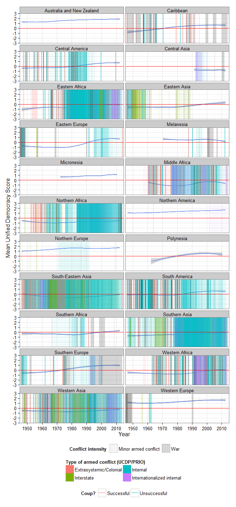
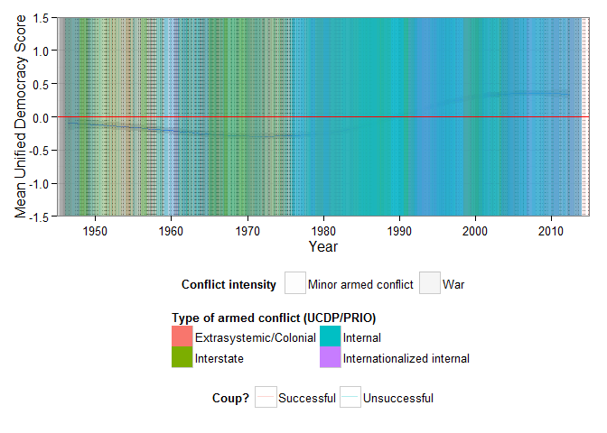
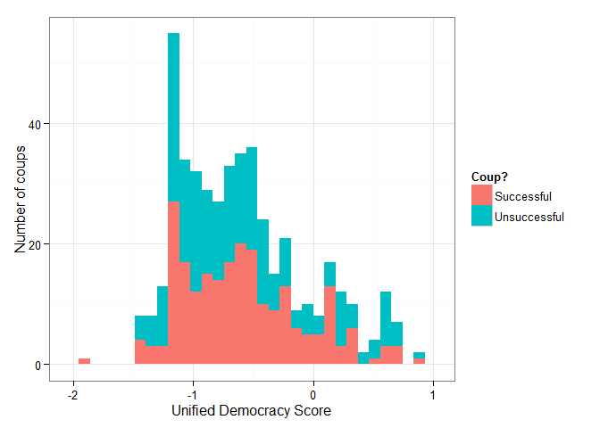
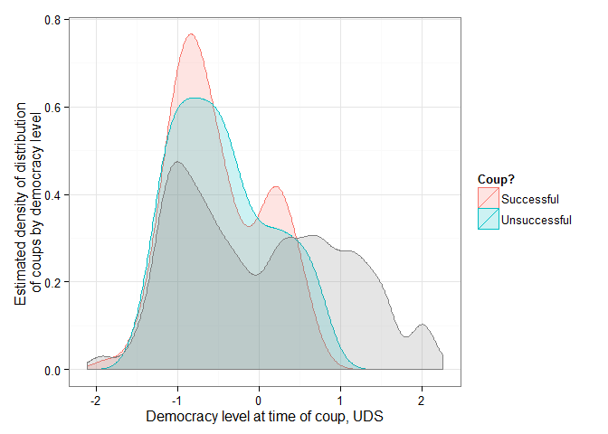
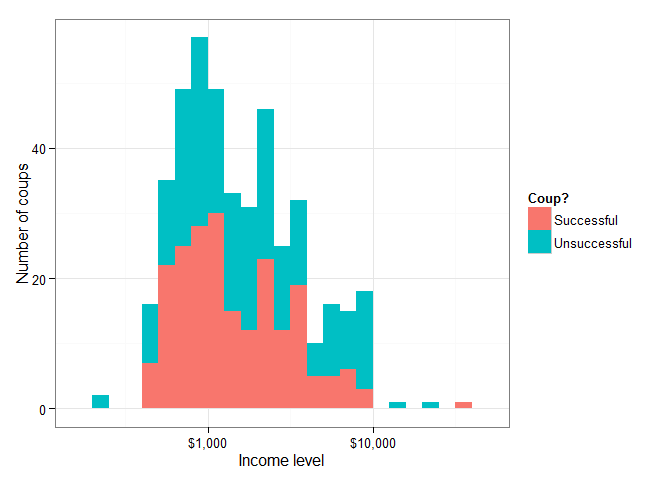
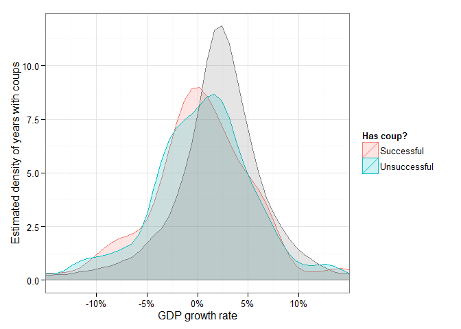

# Political Instability at a Glance

(A graph-heavy post on the post-WWII history of political instability.)

(Update 1/24/2014: Thanks to Profs. Gleditsch, Goemans, and Chiozza for allowing me to use the beta version of [Archigos](http://www.rochester.edu/college/faculty/hgoemans/data.htm), updated with leader information to 2014)

Despite its ubiquity in everyday discourse, I find the concept of "political instability" exasperatingly vague, encompassing everything from polarized electorates to coups to civil war. Nevertheless, one can still understand most of the phenomena that fall under that rubric as the sorts of events that happen when the norms supposedly regulating political competition fail to be "[recognized](http://papers.ssrn.com/sol3/papers.cfm?abstract_id=2027249)" as relevant or worth following by sufficiently powerful groups of people. [Very wide-ranging normative breakdowns are revolutions](http://abandonedfootnotes.blogspot.com/2015/01/the-revolution-as-drinking-party.html) and civil wars (Jack Goldstone [once noted that the great revolutions were characterized by "fractal" breakdowns of norms regulating conduct at all levels](http://www.annualreviews.org/doi/pdf/10.1146/annurev.polisci.4.1.139@violence.2013.1.issue-1)); but coups, other forms of "irregular" leader exit, spikes of protest, and transitional situations can be understood as moments where the norms that are supposed to channel and limit the competition for power break down, either because sufficiently powerful groups disagree about what the relevant norms *are*, or because they want to change them, or because they can disregard them with impunity.  

The identification of political instability events is unavoidably fraught, since what counts as the relevant norm governing political competition, and whether the norm has actually been violated, disregarded, or otherwise violently reinterpreted, will often be disputed. Sometimes it will simply be impossible to tell whether [some particular event -- e.g, the recent happenings in Lesotho or the Gambia -- counts as a coup](https://dartthrowingchimp.wordpress.com/2015/01/07/schrodingers-coup/), or whether the fall of some leader is in accordance with "recognized" norms of political competition; indeed, I take it that sometimes there is simply no fact of the matter, though perhaps the very existence of disagreement about the nature of the event is itself significant as an indicator of instability. And of course many events that signal the weakness of norms regulating political competition -- aborted coup attempts, thwarted palace conspiracies -- simply never see the light of day. Nevertheless, it is still possible to get a glimpse of the broad patterns of political instability during the post WWII era. 

Here's one way of doing it, which produces lovely "[spectral lines](http://astronomy.swin.edu.au/cosmos/S/Spectral+Line)" of macropolitical instability. The picture below graphs five forms of instability, per country: the estimated level of democracy and thus regime change, for the period 1946-2012 (from the [Unified Democracy Scores](http://www.unified-democracy-scores.org/uds.html) by Pemstein, Meserve, and Melton); successful and unsuccessful *overt* coup attempts for the period 1950-2014 (vertical red and blue lines, respectively, from the [data gathered by Powell and Thyne](http://www.jonathanmpowell.com/coup-detat-dataset.html), supplemented before 1950 with data for successful and attempted coups from [Marshall and Marshall](http://www.systemicpeace.org/inscrdata.html)); irregular leader exits (dotted black lines, sometimes coinciding, sometimes not, with the coup data from Powell and Thyne, and including everything from assassinations to revolutionary overthrow that occurs outside whatever *prima facie* normative framework of political competition holds in the particular country), from the period 1946-2014 (from the beta version of the [Archigos](http://www.rochester.edu/college/faculty/hgoemans/data.htm) dataset by Goemans, Gleditsch, and Chiozza - thanks for prof. Gleditsch for sharing a copy!); shaded colored areas track armed conflict episodes from 1946 to 2013 (from the [UCDP/PRIO](http://www.pcr.uu.se/research/ucdp/datasets/ucdp_prio_armed_conflict_dataset/) dataset); and light grey shaded areas track periods of "interruption," "interregnum," or "transition" (basically, foreign occupation, anarchy, political breakdown or explicitly transitional governments) from the [polity dataset](http://www.systemicpeace.org/inscrdata.html), in the 1946 to 2013 period. The figure is arranged regionally, by continent: African countries first, then American countries, then Asian, and so on, so that countries in geographical proximity to one another appear close together in the picture:  

 

Coups, wars, irregular leadership transitions, changes in democracy, and periods of "interruption" are distinct phenomena, but they all indicate historical moments where the norms regulating "macropolitical" competition are fluid: where powerful parties don't agree about the definition of the state, the procedures for transferring power, etc. The graph is deliberately crowded -- it is meant to produce an overall glimpse of the "spectrum" of instability in the postwar history of each country, not a detailed history of each country -- yet some events are easily identifiable: major interstate wars (in green: the Korean War, the Vietnam war, the Ethiopia-Eritrea conflict, the Yugoslav wars); colonial liberation struggles (in red, such as the struggle for independence in Zimbabwe); the interminable series of conflicts of the Burmese state against its outlying "[Zomian](http://abandonedfootnotes.blogspot.co.nz/2010/10/footnotes-on-things-ive-been-reading.html)" minorities; the endless series of coups and countercoups in Argentina starting with Peron's first presidency in 1946; the coup against Allende in Chile in 1973; the disintegration of the Afghan state since the 80s; the transition to democracy in Spain; and so on. Each country has its own distinctive pattern of macropolitical instability, though in general wherever a country has experienced these sorts of events they have tended to "cluster" in time; macropolitical instability is rarely continuous over long stretches. Similar events also have a tendency to happen in similarly-situated countries, leading to distinct regional patterns: 

 

At this level of aggregation we can see that South American countries have suffered more from coups than from armed conflict, yet coups and irregular leader exits have declined in frequency over the last three decades; that South and South-East Asian states (Myanmar, India, Vietnam, Laos, etc.) have suffered much more from armed conflict of all kinds than from coups; how states in Western Africa and Eastern Asia (basically, the Middle East) have seen a simultaneous decline in coups and an increase in armed conflict of all kinds. (Distinct events with regional implications are also visible - e.g., the central American wars of the 1980s). It is worth noting that these patterns coexist with an increase in measured levels of democracy in most regions of the world since the middle of the 1980s. (The horizontal red line in each picture represents a score of zero in the UDS data, which can be interpreted as the dividing line between democracy and autocracy; by that criterion, in a majority of regions of the world a majority of countries are democratic today, though in some cases barely so). 

I suspect that some of these patterns are basically attributable to the timing of consolidation of post-colonial states. For example, if we could extend these pictures back in time we would see many more internal and even some external conflicts in Latin America, as states were consolidated after independence from Spain; much of the internal conflict we see in places like India or Myanmar against groups on their borderlands can be understood as state-consolidation conflict - conflict over who is subject to state power, and to what degree. But as states consolidate, struggles over the definition of the state may give way to struggles over the norms of political competition (coups and irregular leader exits); and these in turn can eventually either lead either to "stability" (relative consensus on the norms of political competition, or at least the victory of one faction or person over the rest, as in long-term personal dictatorships, leading to a decline in in coups and other forms of irregular leader exit) or state disintegration (renewed internal conflict). Consider a picture at an even higher level of aggregation, by continent:

 

One interpretation of this figure might go like this: the anticolonial struggles of African countries give way by the 70s to a fluid period of coups and countercoups as various powerful groups struggled to define the norms of political competition for control of the new states, often with the intervention of major powers during the Cold War. Yet instead of leading to the eventual victory of some particular norm of political competition, coups and countercoups eventually escalated into renewed conflicts over the very definition of the state -- "internal" wars of various kinds -- since the post-colonial state was a pretty recent and fragile creation to begin with. By contrast, in the Americas, the tendency has been for norms of "democratic" political competition to become entrenched in the context of relatively consolidated states; while the military may still intervene in politics, they find it harder to do so in an overt way. Though there are many reasons for this (including, e.g., changes in the foreign policy of the US) one important factor seems to have been the lessening of radical ideological conflict, which means deviations from norms of democratic competition are more costly and have less point. In fact, the risk of military intervention in politics in Latin America appears to remain highest [precisely where ideological conflict over the nature of the state is fiercest](http://dx.doi.org/10.1007/s12116-013-9128-9), as in Venezuela and Ecuador. The Asian pattern in turn is less about the consolidation of new states than about border adjustment after the colonial period and the bringing of borderlands under central state control, rather than about the consolidation of new states; while the European post-war pattern mostly involves the late transitions to democracy of Southern Europe and separatist conflicts of varying intensity - all legacies of the wars of the first half of the 20th century, which of course are not visualized here. 

For completeness, here are the political instability spectral lines of the world:

 

This is not especially informative (though it does show the trend away from interstate to intrastate conflict, and the long-run transition to norms of democratic political competition around the world), but I find it strangely beautiful.

Instead of aggregating these pictures of political instability, we can disaggregate them and expand them into "geological" pictures of the historical strata of political change. Here's one way of using the enormous amount of information available in these datasets to auto-generate political histories, using the example of Argentina. For the picture immediately below, start at the top, at the end of 2014; as we scroll down (the image is in its natural element online, with its endless scrolling; but one can imagine also a slowly unrolling codex) we move deeper into the country's history. The first thing we encounter is the name of the serving president as of the end of 2014, Cristina Fernandez de Kirchner; the name is grayed out - "still in office as of 2014;" leaders who died in office, retired without serving their full term, or were removed by irregular means (e.g., by a coup) are in darker font, to make them stand out (the darker, the more irregular). Each leader's name is placed at the date of his or her exit from power (or 2014 if still in office by the time the Archigos dataset ends), so anything below Kirchner until the next name appears happened during the Kirchner government. If data are available, we see a thick black vertical line representing the Polity score for that year; the further to the right, the more "democratic" its forms of political competition. A "thicker" measure of democracy, represented by the squiggly grey line with the ribbon, is also depicted -- the [Unified Democracy score](http://www.unified-democracy-scores.org/index.html), which aggregates information from various attempts to measure democracy in a consistent way -- and scaled to fit in the same interval. Polity and the UD scores agree on the basic pattern, though the UD scores do not see Argentina's democratic institutions as fully consolidated by the end of 2012 (the last year of the UDS dataset); Argentina does not achieve the highest scores (which would put it bumping against the right side of the graph), and appears to be trending slightly leftwards as of 2012 (less democratic in this graph; no political implication intended). The blue line with dollar numbers represents Argentina's annual per capita GDP, as estimated by [Angus Maddison and his successors](http://www.ggdc.net/maddison/maddison-project/home.htm): Argentina is a solidly middle-income country by 2010. 

As we move down further, we encounter the end of the last military government, shortly after the end of the Falklands war, in 1984; the caretaker [Bignone](http://en.wikipedia.org/wiki/Reynaldo_Bignone) presides over the extrication of the military from government after [Galtieri](http://en.wikipedia.org/wiki/Leopoldo_Galtieri), who was mainly responsible for the war, is forced to leave office by his military colleagues. The period before that is one of coups and overall economic stagnation; more generally the pattern of Argentine history over the previous couple of decades is one of continual conflict in the context of boom and bust economic cycles, as we can see by the number of coups, irregular leader exits, and the conflict with the [ERP](http://en.wikipedia.org/wiki/People%27s_Revolutionary_Army_(Argentina)). This is the time of the "[dirty war](http://en.wikipedia.org/wiki/Dirty_War)," though it's worth stressing that it was also a period in which divisions within the military were exacerbated by the conditions of Argentine politics; most coups in the period replaced military leaders, not democratically elected leaders. As we move down (back in time), we see the traces of the "impossible game" between [Peronistas](http://en.wikipedia.org/wiki/Peronism) and the military Guillermo O'Donnell described in his [classic analysis of bureaucratic authoritarianism](http://en.wikipedia.org/wiki/Guillermo_O%27Donnell). Periods of repression alternate with classic populism in which the Peronistas are allowed to compete for power, each side of the conflict attempting to consolidate its advantages by transferring resources to its supporters in ways that always proved to be unsustainable given Argentina's dependence on the vagaries of foreign trade (represented by the generally flat trend in GDP, with many ups and downs); but no one ever fully succeeded in fully consolidating power before the terms of trade turned, inflation went haywire, and social conflict instigated either military withdrawal or military intervention. As we move deeper in time, we find that the period of instability really began in the 1930s, with the overthrow of Irigoyen, when Argentina is already a relatively rich country. Before the 1930s we find stability at a lower level of democracy: Irigoyen was preceded by a long sequence of leaders who left office in a regular manner without being overthrown by the military. We might thus speak of a "great cycle" of macropolitical instability from the 30s to the mid 80s, which probably had something to do with the way in which Argentina became integrated into the world economy (according to my meager reading, at least), though the decisions of successive governments as they attempted to consolidate their bases of support -- repression, coups, particular monetary and fiscal policies -- seem to have exacerbated the conflicts of the period.

 

Because I have a bad memory for people and dates, I like these pictures as *aide-memoires*, though of course they will only make full sense if one knows a little about the political history of the countries depicted. It's also worth stressing that the datasets involved have gaps and other problems. Though the universe of successful coups since 1945 is pretty well covered, for example, some "unsuccessful" coups never get reported, some coup-like events are not included due to ambiguity, and of course we do not see here spikes of nonviolent protest aimed at changing the norms of political competition (one could use the [NAVCO data](http://www.du.edu/korbel/sie/research/chenow_navco_data.html) for this, but I had to stop somewhere, and the graphs are overcrowded enough already). The GDP data [is sometimes dubious or interpolated](http://www.tandfonline.com/toc/rcjd20/35/1), especially for some of the poorest countries, and of course it does not show the full the range of issues affecting living standards. ~~And Archigos stops at 2004 (though it's being updated), providing sometimes a false picture of stability for some countries over the last decade.~~ [Updated: now using data to the end of 2014] 

Nevertheless, more auto-generated political histories for 173 countries in the Polity dataset are available [in the GitHub repository for this post](https://github.com/xmarquez/political-instability-at-a-glance/tree/master/Histories%20of%20instability). One can take a look at some really eventful histories, like those of [Haiti](https://github.com/xmarquez/political-instability-at-a-glance/blob/master/Histories%20of%20instability/Haiti.png) and the [Dominican Republic](https://github.com/xmarquez/political-instability-at-a-glance/blob/master/Histories%20of%20instability/Dominican%20Republic.png), which are full of irregular leader exits; or at [Venezuela](https://github.com/xmarquez/political-instability-at-a-glance/blob/master/Histories%20of%20instability/Venezuela.png), which shows both the period of democratic consolidation following the overthrow of Perez Jimenez, marked by several coup attempts, and the long economic decline preceding the rise of Chavez; or indeed, any number of others. In general, one pattern emerges from these more detailed pictures, namely that there are two basic forms of stability: the kind that comes about when a single person achieves full personal power and successfully "[coup-proofs](http://dx.doi.org/10.1162/016228899560202)" his rule (e.g., [Trujillo](http://en.wikipedia.org/wiki/Rafael_Trujillo) in the Dominican Republic, [Duvalier](http://en.wikipedia.org/wiki/Fran%C3%A7ois_Duvalier) in Haiti, [Gomez](http://en.wikipedia.org/wiki/Juan_Vicente_G%C3%B3mez) in Venezuela) and the kind that comes about when some norm of political competition is expected to be enforceable even at the death of the ruler. The first kind of stability is clear when you see a spike of coups, conflicts, constitutional crises, or irregular leader exits that signal some sort of succession crisis - a sure sign of a previous personal regime. It seems really difficult to transform regimes based on loyalty to a person into regimes where impersonal norms of political competition have "bite"; the instability after the overthrow of Gaddafi is more the rule than the exception, regardless of whether the leader was overthrown or died peacefully in office.

Let's look at coups in more detail, because they are perhaps the most dramatic single event in the data - a single short spike in these spectral lines. The first thing to note is that they are associated with lower measured levels of democracy:

  

In other words, coups have historically occurred most often in already non-democratic regimes; a famous coup against a democratically elected leader like the ouster of Allende in Chile appears to be less common than the many forgotten coups against military regimes all over the world. (Iraqi Prime minister Abu Zuhair Tahir Yahya is reported to have said in 1968, "I came in on a tank, and only a tank will evict me," according to [Luttwak's classic handbook on the coup d'etat](http://books.google.co.nz/books/about/Coup_D_etat.html?id=K5OnWYLhQBAC&redir_esc=y); most coups in the postwar era seem to have been against people who came in on tanks). Few coups take place against the "consolidated" democratic regimes, which is simply another way of saying that norms of political competition in such countries are recognized as binding by all powerful parties. But we also see few coups against the most autocratic regimes, which are typically regimes where a party or an autocrat has fully coup-proofed their rule. 

Coups are thus a symptom of normative fluidity, while both fully autocratic regimes and consolidated democracies are consolidated precisely because their norms of political competition are *not* fluid, as [Finer saw](https://books.google.co.nz/books?id=4lhgDBDWw3AC) in his classic study of the subject. This is why one of the best predictors of the risk of a coup is another recent coup; "the claim to rule by virtue of superior force invites challenge; indeed it is itself a tacit challenge, to any contender who thinks he is strong enough to chance his arm" which "succinctly explains one of the most usual consequences of a military coup, namely a succession of further coups by which new contenders aim to displace the first-comers. 'Quitate tu, para ponerme yo,' runs the appropriately Spanish proverb." (the quote is from Finer, *The Man on Horseback*, pp. 17-18; for the statistical evidence, see [here](http://jcr.sagepub.com/content/47/5/594.abstract)).

Most coups nevertheless result in some immediate reduction in the level of democracy as new leaders attempt to consolidate their power (and thus engage in repression), but especially since the end of the cold war, many coups are on average followed a few years later by some degree of democratization (or re-democratization). The classic case was the "[revolution of the carnations](http://en.wikipedia.org/wiki/Carnation_Revolution)" in Portugal which overthrew the "Estado Novo", and which led to the modern democratic regime there. Though not every coup today is a liberalizing coup, in general there has been more pressure for countries to hold elections and less tolerance for overt military rule since the 1990s, as [Marinov and Goemans argue in detail](http://dx.doi.org/10.1017/S0007123413000264). Given the dependence on aid of many coup-prone countries, this has typically resulted in quicker democratization after a coup than before the end of the cold war, where dictatorships of various kinds could count more consistently on various forms of superpower patronage. The figure below shows the aggregate pattern quite strikingly: 

 

It's also worth noting that over the post war period coups did not always lead to military rule; on the contrary, they often issued in power struggles that led to personal dictatorships or other forms of authoritarianism. Indeed, "pure" military rule has been quite rare and short-lived in the modern period (characterized by professional militaries rather than military aristocracies); as Finer noted, and [later research seems to confirm](http://dictators.la.psu.edu/pdf/pp10.pdf), some of the very features that give militaries in certain societies the ability to seize power make them particularly unsuited to ruling these same societies without extensive civilian collaboration, and in any case direct military rule tends to exacerbate divisions in the organization. 

Using data gathered by [Geddes, Wright, and Frantz](http://sites.psu.edu/dictators/) on regime types, focusing on whether the main institutions of the regime are the military, a single party, a monarchy, or some combination of the three, and on the degree of "personalism" in the regime, we can use it to look at which coups were followed by periods of rule by the military as an institution: 

 

As we can see, the periods of pure military rule (in blue) and mixed military rule (in green; this includes regimes that used a civilian party or where power was also highly concentrated in the leader rather than in a Junta) are surprisingly few; most coups have led to non-military dictatorships, especially personal ones. (Small quibble: the Geddes, Wright and Frantz data shows the difficulties of the enterprise of classification, and the ambiguities of political reality. For example, they classify the Franco regime as a "personal" dictatorship for its entire period; but any student of the Franco regime can tell you that power fluctuated, with the Falange and the military much more powerful early in the regime, though there is clearly a sense that power was highly concentrated in Franco early on as well. I would have classified the Franco regime as a hybrid military-personalist regime). 

Coups are [more common](http://links.jstor.org/sici?sici=0043-8871%28199001%2942%3A2%3C151%3APTCTAT%3E2.0.CO%3B2-P) in [poor countries](http://jcr.sagepub.com/content/47/5/594.abstract), as one might have expected:

  

But how, exactly, does poverty matter? After all, some surprisingly rich countries have experienced lots of coups, while some very poor countries have had little recorded instability of any kind. Consider this picture, which replicates the first graph of this post, except that the countries are arranged from poorest to richest, and the squiggly line in the middle represents GDP per capita:

 

Here we see many high-middle income countries that were plagued by coups in the past and sometimes still today (Argentina, Thailand, Syria, Qatar) while some extremely poor countries have never experienced coups (e.g., Malawi). Poverty seems to matter only where authority norms find few organized defenders, or rulers have failed to coup-proof their regimes; and this only because very poor societies seem to have been commonly places where the only organized force of national stature has been the army, and coup-proofing is tricky political work requiring resources that are not always available. (Finer's views are still quite reliable here, though he tends to speak too much of "legitimacy" when he really means organized support; it's not that poor people welcome coups or military rule, but that in poor societies the organized groups that have power are often incapable of resisting the army, and in twentieth century contexts powerful groups have had many different views over which authority norms should prevail). 

Interestingly, though poverty is strongly associated with coups (and is typically found to be a significant risk factor in quantitative studies), *growth* is not so strongly associated with coups; it is actually quite hard to find a significant effect of growth on coups in the quantitative literature, despite the fact that it's easy to tell stories about how economic decline might be a trigger of political instability. Though coups have clearly happened in periods of both growth and decline, one could nevertheless squint at the distribution of growth rates in years with coups and conclude that coups have tended to happen in years with slightly lower growth rates than average:

 

Indeed, it is not even clear that coups result in lowered growth rates in their aftermath (though as far as I can tell the statistical evidence suggests coups typically lead to some decline in growth rate). Consider this picture, showing normalized GDP (100 at the year of the coup) in the years before and after a coup or coup attempt (successful coups are in red, unsuccessful attempts are in blue):

 

In some cases, we see a U-shaped pattern - economic decline followed by coup, followed by recovery later; in others we see a line sloping down, and in others we see a line sloping up. Coups have happened when income was growing greatly (Libya), and when income has been declining greatly (Iraq, Chile); in periods of recurrent boom and bust cycles (Argentina) and in periods of apparent macroeconomic stability (Thailand, Greece). Sometimes they have been followed by quick recoveries, others by wild fluctuations; ten years after the Pinochet coup Chilean GDP was at the same level as in 1973, though it had oscillated wildly in the intervening period. The key point seems to be that coups are symptoms of underlying political conflict, which may be triggered by factors other than economic instability; even in the Argentine case, where coups where recurrently triggered during economic crises, the problem seems to have been the political conflicts (strikes, riots, etc.) that often came with the economic crisis and that made the military frame the situation in security terms. Thus the relationship between coups and economic growth will depend on the relationship between political conflicts and economic life. 

Nevertheless, the macroeconomic aftermath of coups also seems to have varied from before and after the cold war, in line with the [Marinov and Goemans](http://dx.doi.org/10.1017/S0007123413000264) thesis mentioned above:  

 

Coups before the cold war on average seem to have happened in periods of growth, and were not necessarily followed by economic recession; coups afterwards seem to have happened on average during periods of severe economic contraction and to have led to further declines. Perhaps this shows that coups have been punished more severely in the post Cold war era, so that only severe economic crisis has led to coups after 1990; or that coups during the cold war happened more often in countries where economic performance is more or less independent of political stability (e.g., oil-dependent countries, like Iraq). But I found the lack of obvious connection between political instability and economic instability striking.

I think overall it is probably fair to say that some forms of macropolitical instability (coups, irregular leader exits, regime transitions involving major normative changes, like transitions from monarchy to democracy) seem to be on the wane. But there is little in this history suggesting that such instability ever definitively ends; on the contrary, though some countries have good long runs of stability, big shocks to the global system (big economic changes, big wars) can trigger periods of instability with very long after-effects. This is probably a bit depressing; it suggests that the events started by the Arab uprisings, for example, will take a long while to work themselves out (mostly in ways that involve "political instability"), until a new normative equilibrium is eventually reached. 

Code for all the graphs in this post is available at [this Github repository](https://github.com/xmarquez/political-instability-at-a-glance). The vast majority of the code is basically data-munging; you will need to download some of the datasets separately. 

(Update, 1/21/2014: minor changes in wording to improve clarity)

(Update, 1/24/2014: using Archigos data for 2014 now)
